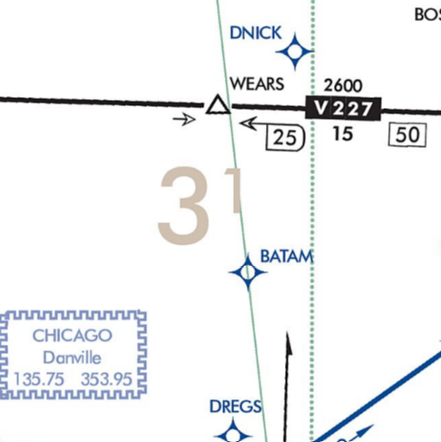

---
tags:
  - minimum-altitudes
  - enroute-charts
  - oroca
---

### Question

What are the light brown numbers on the enroute chart, and what do they mean?

### Answer

- Off-route obstruction clearance altitude (OROCA) - Guarantees 1,000 ft clearance in non-mountainous areas and 2,000 ft in mountainous areas
- You are not guaranteed any reception

### Sources

- [14 CFR § 91.177 - Minimum altitudes for IFR operations](https://www.ecfr.gov/current/title-14/chapter-I/subchapter-F/part-91/subpart-B/subject-group-ECFRef6e8c57f580cfd/section-91.177)
- [FAA Aeronautical Chart User's Guide](https://www.faa.gov/air_traffic/flight_info/aeronav/digital_products/aero_guide/)
- [FAA AIM ¶ 5-3 - En Route procedures](https://www.faa.gov/air_traffic/publications/atpubs/aim_html/chap5_section_3.html)
