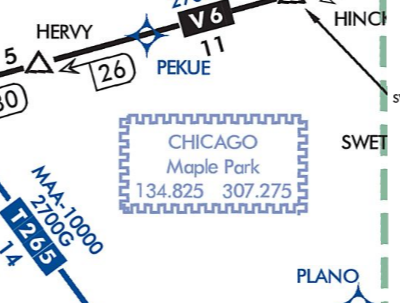

---
tags:
  - enroute-charts
---

### Question

What is the purpose of the "Chicago Maple Park 134.825 307.275" box on an enroute chart?

### Answer

It is a Remote Center Air/Ground facility, located in Maple Park.  This is the frequency to use if you need to re-establish ATC contact, but do not have a specific frequency to use.

### Sources

- [FAA AIM ¶ 5-3-1](https://www.faa.gov/air_traffic/publications/atpubs/aim_html/chap5_section_3.html#5-3-1)
