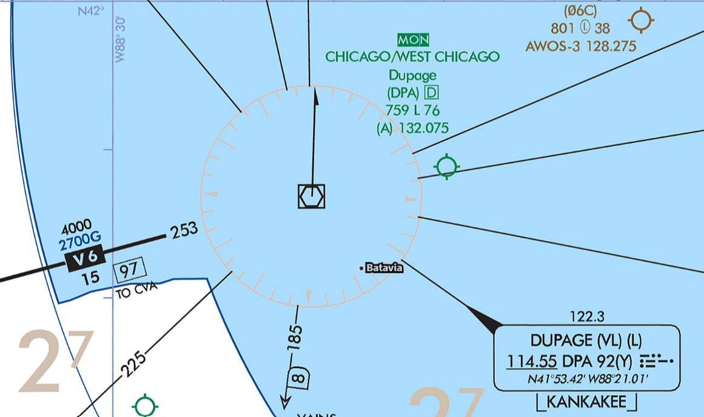

---
tags:
  - enroute-charts
  - mon
---

### Question

What does "MON" mean for KDPA? Why does it matter to you?

### Answer

- It's part of the Minimum Operational Network (MON), which indicates it has a ground-based IAP (e.g., ILS, LOC, or VOR) that does not require DME or GPS in the case of a GPS outage (e.g., all fixes can be identified using cross-radials)
- Useful in the case of a GPS outage or an issue with your GPS

### Sources

- [FAA Aeronautical Chart User's Guide](https://www.faa.gov/air_traffic/flight_info/aeronav/digital_products/aero_guide/)
- [FAA AIM ¶ 5-3 - En Route procedures](https://www.faa.gov/air_traffic/publications/atpubs/aim_html/chap5_section_3.html)
