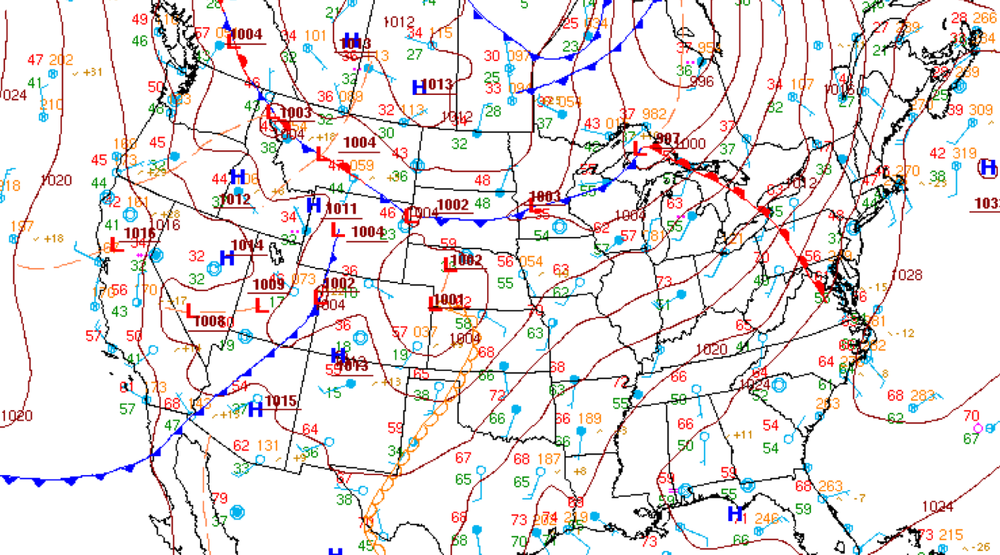

---
tags:
  - surface-analysis
  - weather-charts
---

### Question

Refer to the surface analysis chart from the source guide.

What is an occluded front, and what kind of conditions are associated with it?

### Answer

- Looks similar to a stationary front, but is entirely purple
- It happens when a cold front, which typically moves faster, catches up to a warm front moving in the same direction
- When the cold front is colder than the air in front of the warm front (“cold front occlusion”), it lifts the warm air up and generates heavy rainfall
- When the cold front is warmer than the air in front of the warm front (“warm front occlusion”), it slides in between the warm and colder air and generates gradual weather changes, including prolonged periods of rain

### Sources

- [FAA Aviation Weather Handbook, Chapter 25 - Analysis (surface charts, isobars, fronts)](https://www.faasafety.gov/files/events/SO/SO15/2024/SO15129447/FAA-H-8083-28Chpt25.pdf)
