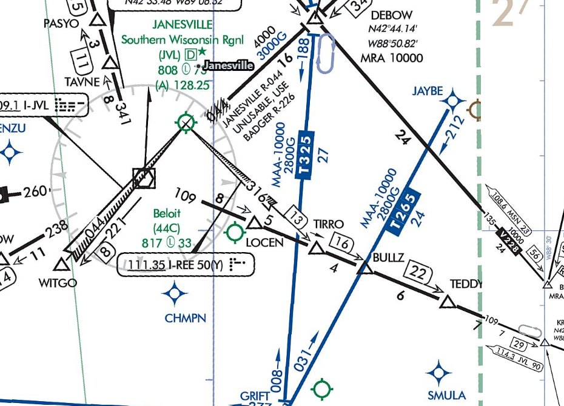

---
tags:
  - airways
  - enroute-charts
---

### Question

What is T325 just east of KJVL?

### Answer

A Tango airway - an RNAV airway made up of GPS fixes

### Sources

- [FAA Aeronautical Chart User's Guide](https://www.faa.gov/air_traffic/flight_info/aeronav/digital_products/aero_guide/)
- [FAA AIM ¶ 5-3 - En Route procedures](https://www.faa.gov/air_traffic/publications/atpubs/aim_html/chap5_section_3.html)
- [FAA AIM Section 1-2 - Performance-Based Navigation (PBN) and Area Navigation (RNAV)](https://www.faa.gov/air_traffic/publications/atpubs/aim_html/chap1_section_2.html)
