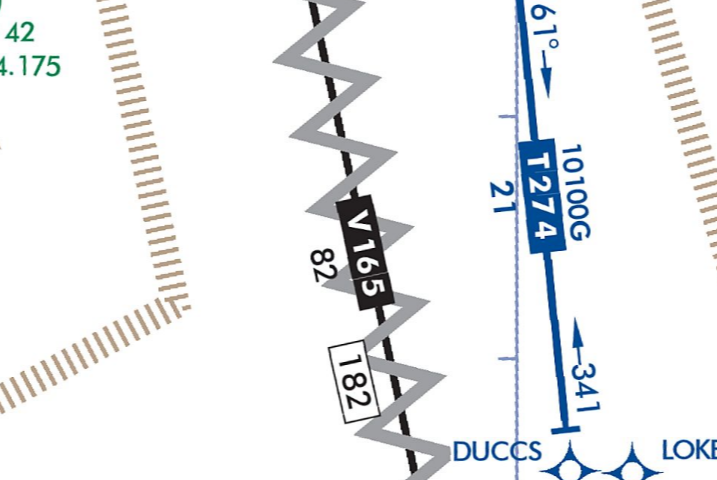

---
tags:
  - airways
  - enroute-charts
---

### Question

What is the squiggled-out V165 airway? Can I fly it?

### Answer

- They are unusable parts of the route, due to not enough guaranteed signal
- You cannot file or accept a clearance that includes them, although you could fly point-to-point using RNAV

### Sources

- [FAA Aeronautical Chart User's Guide](https://www.faa.gov/air_traffic/flight_info/aeronav/digital_products/aero_guide/)
- [FAA AIM Chapter 5, Section 3 - En Route procedures](https://www.faa.gov/air_traffic/publications/atpubs/aim_html/chap5_section_3.html)
- [FAA AIM ¶ 1-2-1 - Performance-Based Navigation and Area Navigation](https://www.faa.gov/air_traffic/publications/atpubs/aim_html/chap1_section_2.html)
