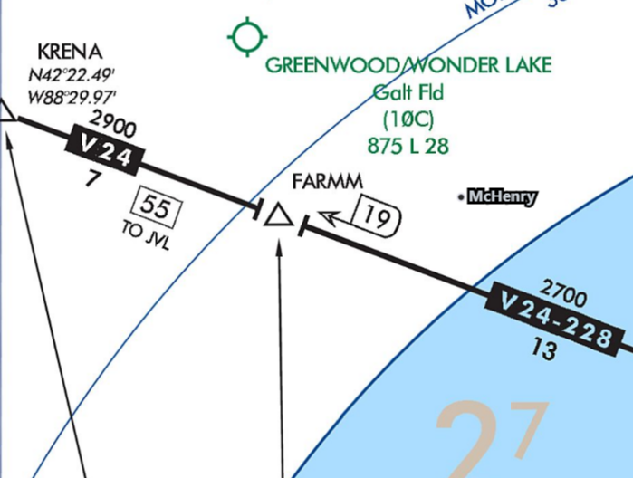

---
tags:
  - airways
  - enroute-charts
---

### Question

What does the "19" mean next to FARMM on the V24-228 airway mean?

### Answer

The total distance from the navaid (OBK) to that fix

### Sources

- [FAA Aeronautical Chart User's Guide](https://www.faa.gov/air_traffic/flight_info/aeronav/digital_products/aero_guide/)
- [FAA AIM ¶ 5-3 - En Route procedures](https://www.faa.gov/air_traffic/publications/atpubs/aim_html/chap5_section_3.html)
