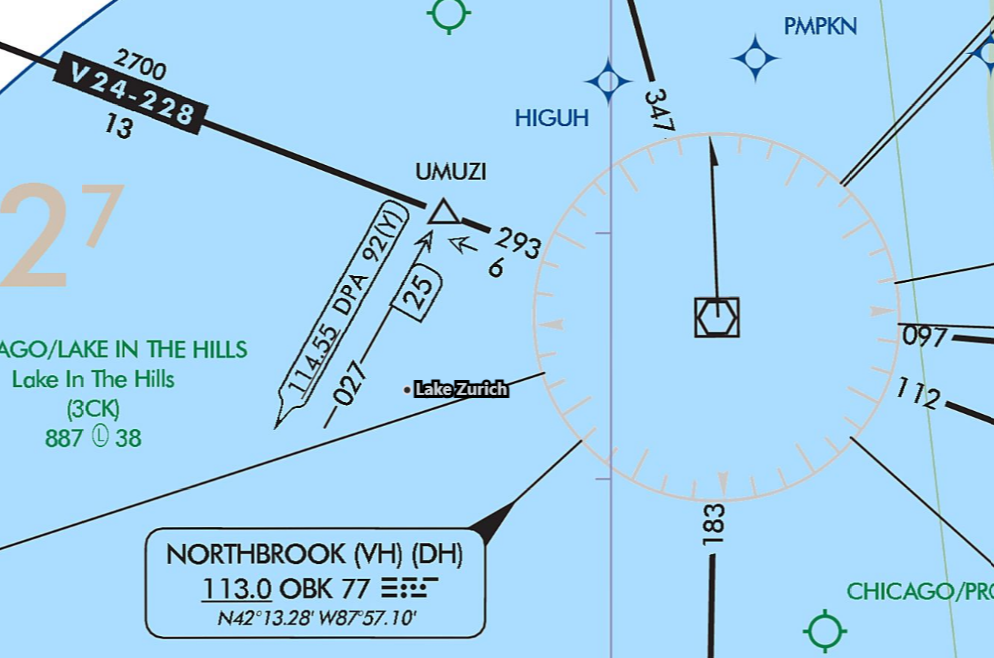

---
tags:
  - airways
  - enroute-charts
---

### Question

On V24-228 off of OBK, what does the "13" mean just underneath "2700"?

### Answer

The segment distance between the two fixes

### Sources

- [FAA Aeronautical Chart User's Guide](https://www.faa.gov/air_traffic/flight_info/aeronav/digital_products/aero_guide/)
- [FAA AIM ¶ 5-3 - En Route procedures](https://www.faa.gov/air_traffic/publications/atpubs/aim_html/chap5_section_3.html)
